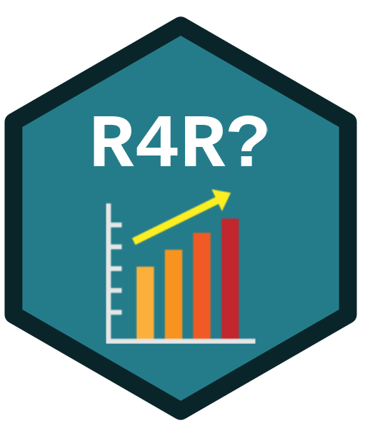

::: {style="text-align: center;"}
{width="182"}
:::

---

# Welcome to "Ready4R?"
This is a workshop session designed for Y2 Undergraduate Psychology Students at Royal Holloway University of London to prepare them for the year ahead using R and RStudio for data analysis.

The workshop comprises of two parts: a guided tutorial with slides and a practical activity.

## License 

This work is licensed under Creative Commons Attribution-ShareAlike 4.0 International License ([CC-BY-SA 4.0](https://creativecommons.org/licenses/by-sa/4.0/)). You are free to share and adapt the material for non-commercial purposes, with appropriate credit and under the same license. If you adapt the material, you must distribute your contributions under the same license.

## Contact

This is resource is a work in progress, and we’re continually updating and improving it.

If you spot an error or something that doesn’t look quite right, please get in touch: luke.kendrick@rhul.ac.uk.
