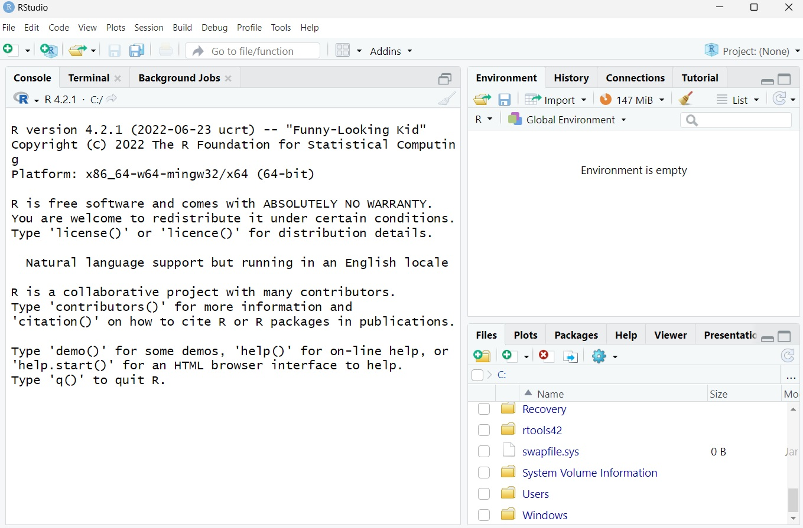
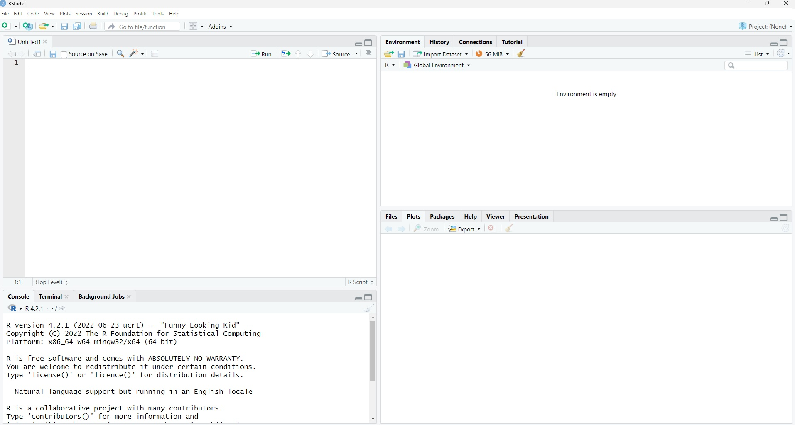
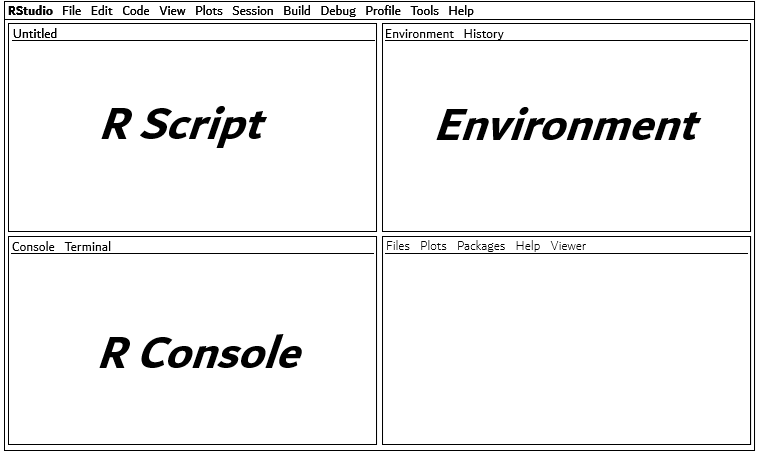
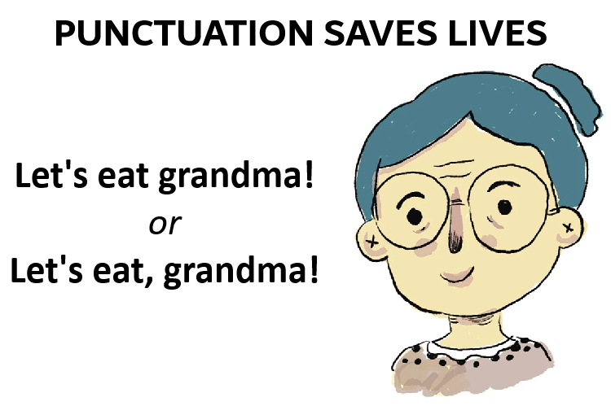
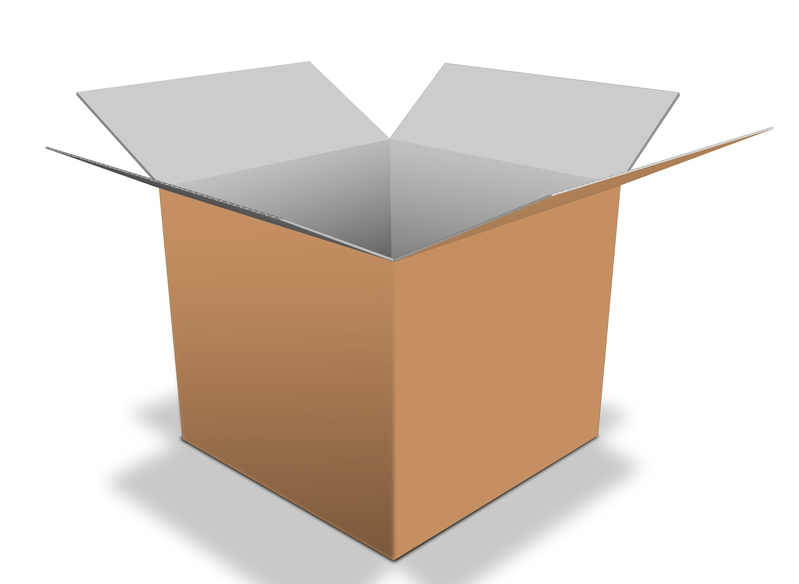

# Introduction

Workshop Aims:

-   Provide an introduction to R and RStudio in preparation for PS2010 Psychological Research Methods.

-   Understand the layout and key features of RStudio

-   Understand the basics of using R code

-   To begin working with data in RStudio and understand key terminology.

# About this Session

-   The first part of the workshop involves a guided tutorial where you should follow along on screen.

-   Raise your hand at anytime if you need help, have a question, or get stuck—someone will come over to assist you.

-   We are not able to offer technical support with R/RStudio on your personal device. For today, please use the campus PCs.

-   The second part of the workshop involves a practice activity to help you feel more confident with R before lecture begin next week.

# R and RStudio

{width="128" height="134"}

-   Rrrrr is not only the noise a pirate makes...

-   R is also programming language. You'll also use RStudio.

-   R and RStudio are not the same thing:

    -   **`R = the language`**

    -   **`RStudio = the program.`**

# Open RStudio I

-   Look for this logo:

{width="214" height="76"}

-   You want to make sure you open RStudio and not "R" which also exists on the computer. That runs in the background.
-   Make sure you see the word **studio**!

# Open RStudio II

When you first open RStudio it should look like this:

{width="700"}

# RStudio Layout I

-   When RStudio opens you'll see **three** panels. We actually want a fourth open.

-   Open a new script by going to: `File` \> `New File` \> `R Script`

-   You can also use:

    -   `CTRL` + `SHIFT` + `N` (windows)

    -   `CMD` + `SHIFT` + `N` (mac)

# RStudio Layout II

Now your RStudio should look like this. There are **four** panels:

{width="700" height="461"}

# RStudio Layout III

You need to learn what each panel does. We will go through them one by one.

{width="785"}

# Script Panel

{width="420"}

-   The R script is the top left and is an editable space where you can type, enter, and run your code. You can save and share your R script, a bit like a Word document.

# Console Panel

{width="420"}

-   The R console is the bottom left panel. Think of this an “results” panel. This is where you can read the results of your code (or an error message if your code did not work!). Technically you can type your code into this panel, I’d recommend that you never do this because it isn’t possible to save it.

# Environment Panel

{width="420"}

-   The environment panel is the top right panel. It can be helpful to think of this as a bit like a memory space where RStudio will keep hold of any objects/data/information that you ask it to. You’ll learn more about saving things to the environment later in this chapter.

# Miscellaneous Panel

{width="420"}

-   The bottom right panel is what I call the miscellaneous panel. It has a few different purposes that include viewing files, plots, packages, or finding help.
-   Also known as Files/Plots/Packages/Help/Viewer panel.

# RStudio Layout Summary

-   As you progress through this workshop and PS2010, you'll learn more about what these panels can do.

-   A key take home message is that you need **four** of them and that you enter your code in the script (top left) panel.

# Using R Code I

-   Coding sounds scary. However, just think of it as a series of instructions.
-   Like with any language there are rules and a structure.
-   It can be a bit quirky to begin with, even the smallest mistakes can change the meaning.

# Using R Code II

-   A typo or incorrectly placed symbol could mean your code does not work—proof read it carefully and take your time.

{width="533"}

# R Code Basics I

-   In RStudio find the script panel (top left).
-   Enter the following code:

``` r
date()
```

-   When ready use your keyboard to press **`CTRL`** + **`ENTER`**.
-   **`CMND`** + **`ENTER`** on a mac.

Once done, check the console panel (bottom left) and you should see today's date as the result!

# R Code Basics II

-   Congratulations! You've run your first bit of code. Now what...
-   RStudio is a bit like a very fancy calculator.
-   Try and run this code:

``` r
33 + 67
```

-   Or something more complex:

``` r
12345*54321
```

# R Code Basics III

-   In case you have wondered the answer to 12345 x 54321 it is 670592745.

    -   Note that we use an asterisk `*` for multiplication.
    -   You can use `/` for division.

-   Now you should begin to understand the very basics of running code (giving a command or instruction) and then checking the console to see the output, results, or answer.

# Objects and the Environment

-   An object is a key feature of RStudio. An object is a bit like a box.
-   We can store or place something in our box and then place it in a storage unit, like a warehouse (this analogy will make sense soon!).

{width="282"}

# Creating an Object I

-   In RStudio we can assign a value or data to an object. However, you will need to create and name your box. Let’s work through an example.

# Creating an Object II

``` r
box <- "chocs"
```

-   `box` is the name of the object ready for something to be placed inside. You could call a box anything you like, I could have called it `myobject` or `data` if it contained some data.

# Creating an Object III

``` r
box <- "chocs"
```

-   Next there are two individual symbols, which when combined become an assignment operator. It is essentially an arrow `<-` made up of a less than sign `<` and a dash `-`
-   This means anything on the right side of the arrow will be placed into the object (or our newly named box).

# Creating an Object IV

``` r
box <- "chocs"
```

-   `"chocs"` is what I've put in the box. A box of chocolates.
-   It is text information (rather than numbers or data) and so it is in speech marks in our code.
-   Run the code now and then check the environment panel (top right).

# Creating an Object V

-   If you look at the top right panel (called the environment), you should spot that an object has appeared called `box`. That’s your newly created object.
-   The environment panel acts a bit like a warehouse or storage unit for our boxes (see, I told you the analogy would make sense…).
-   When conducting data analysis, you may end up with quite a few objects stored in the environment.

# Creating More Objects

- Almost anything can be committed to an object in RStudio. For example, run and adapt the code below. Change “Luke” to your own name! Then check that your environment to see these additional objects.

```r
my_name <- "Luke"
answer <- 12345*54321
pi <- 3.14
```

# print()

You can check what is in a box easily by running this code:

```r
print(box)
```

Change `box` to the name of the other objects: `my_name`, `answer`, `pi` and check the console each time you run the code.

# Naming Objects I

- Try to keep object names short.
- Often you will need to refer to them in your code, and typing out long names is time consuming.
- Always use lowercase letters and use an underscore `_` if you need a space (or just avoid spaces if you can).
- For example:
```r
name <- "Luke"
```

- `name` is shorter than `my_name`

# Naming Objects II

```r
ans <- answer
```

- `ans` is shorter than `answer`
- You might notice here you've put an existing box into a new box called `ans`.

# Code is Case Sensitive

Try running:

```r
print(Name)
```

- This won't wont work because R is not expecting an uppercase `N`

- Use this instead:

```r
print(name)
```

# Functions and Arguments


```{=html}
<script>
document.addEventListener("DOMContentLoaded", function () {

  const copyIcon = `
    <svg width="13" height="13" viewBox="0 0 24 24"
         fill="none" stroke="currentColor" stroke-width="2"
         stroke-linecap="round" stroke-linejoin="round">
      <rect x="9" y="9" width="13" height="13" rx="2"></rect>
      <path d="M5 15H4a2 2 0 0 1-2-2V4a2 2 0 0 1 2-2h9a2 2 0 0 1 2 2v1"></path>
    </svg>`;

  const checkIcon = `
    <svg width="13" height="13" viewBox="0 0 24 24"
         fill="none" stroke="currentColor" stroke-width="2"
         stroke-linecap="round" stroke-linejoin="round">
      <polyline points="20 6 9 17 4 12"></polyline>
    </svg>`;

  document.querySelectorAll("pre code").forEach(function (codeBlock) {

    const pre = codeBlock.parentElement;

    const button = document.createElement("button");
    button.className = "copy-code-button";
    button.type = "button";
    button.innerHTML = copyIcon;
    button.title = "Copy code";
    button.setAttribute("aria-label", "Copy code");

    button.addEventListener("click", async function () {

      await navigator.clipboard.writeText(codeBlock.innerText);

      button.innerHTML = checkIcon;
      button.title = "Copied";

      setTimeout(function () {
        button.innerHTML = copyIcon;
        button.title = "Copy code";
      }, 1500);

    });

    pre.style.position = "relative";
    pre.appendChild(button);

  });

});
</script>
```
